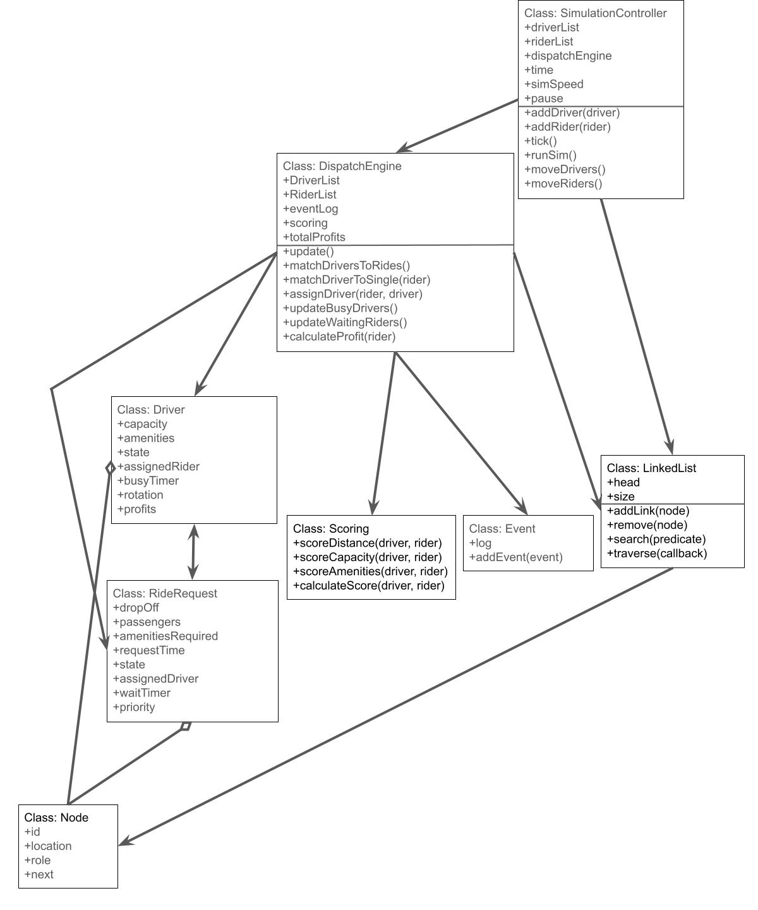

# Ride Share Simulation

This project is a browser-based ride-share dispatch simulation. It uses custom linked lists to manage drivers, ride requests, expired riders, and the event log.

## Project Documents

- [Daily Log](DAILY_LOG.md)
- [AI Usage](AI_USAGE_LOG.md)
- [Time Complexity](TIME_COMPLEXITY.md)

## UML Diagram



## Requirements

- `git`
- `python3`
- A modern browser such as Chrome, Edge, or Safari

There is no build step and no package install step.

## Run The Simulation

1. Clone the repository:

```bash
git clone https://github.com/AlistairTomori1/ride-share
cd ride-share
```

2. Start a local web server from the project folder:

```bash
python3 -m http.server
```

3. Open the simulation in your browser:

```text
http://localhost:8000
```

4. Keep the terminal window open while using the simulation.

## Basic Use

When the page loads, the simulation starts automatically.

The screen is split into:

- left side: simulation map
- right side: control and information panel

## Tabs

The right panel has four main tabs:

- `Driver/Rider List`
- `Events`
- `Settings`
- `Stats`

### Driver/Rider List

This tab shows the current simulation state.

Controls:

- `Pause`: pauses or resumes the simulation
- speed buttons: `0.5X`, `1X`, `2X`, `10X`

Sub-tabs:

- `All`: drivers, riders, and expired riders
- `Drivers`: only the driver list
- `Riders`: priority and non-priority riders
- `Expired`: only expired riders

### Events

This tab shows the visual event log with timestamps.

- newest events appear at the top
- older events move downward
- the visual linked-list event log is capped at 200 events

### Settings

This tab contains simulation controls.

Available controls:

- `Surge`: spawns 10 ride requests immediately
- `Text only mode`: toggles the map rendering off and keeps the text UI
- `Pause`: pauses or resumes the simulation
- speed buttons: `0.5X`, `1X`, `2X`, `10X`
- grid size buttons: `5`, `10`, `20`, `40`, `80`
- `Set driver count`: enter a number and the simulation resets with that many drivers
- target busy ratio buttons: `50%`, `65%`, `85%`, `100%`, `120%`

Notes:

- changing driver count resets the simulation
- higher target busy ratios make rider spawning more aggressive
- `120%` intentionally pushes demand above full utilization

### Stats

This tab shows summary statistics and batch-run controls.

Current stats shown include:

- average wait time
- average ride time
- expired rides per hour
- average percent of busy drivers
- total rides done
- total earnings

Buttons:

- `Run Batch`: runs the simulation for a chosen number of hours without normal rendering
- `Download Event Log`: downloads the full event log as a text file

## Batch Run Mode

The Stats tab can run a faster non-visual simulation.

1. Open the `Stats` tab
2. Click `Run Batch`
3. Enter the number of simulated hours
4. Wait for the batch run to finish

After the batch finishes, an end-of-simulation screen appears with:

- final statistics
- `Download Event Log`
- `Back to Sim`

## Event Log Behavior

There are two event log outputs:

- visual event log: shown in the `Events` tab and capped at 200 events
- export event log: full event history used for the downloaded text file

So even after old visual events are removed from the on-screen log, the downloaded file still contains all events recorded during that run.

## Simulation Time

The simulation clock starts at:

```text
January 1, 2026, 12:00 AM
```

Clock behavior:

- at `1X`, 1 real second = 1 simulated minute
- at `2X`, 1 real second = 2 simulated minutes
- at `0.5X`, 1 real second = 30 simulated seconds
- at `10X`, 1 real second = 10 simulated minutes

This affects the displayed simulation clock. The movement and dispatch logic still run using the simulation update loop.

## Troubleshooting

- If the page is blank, make sure you started the local server from the project root and opened `http://localhost:8000`.
- If controls do not seem to respond after a batch run, click `Back to Sim` on the end screen.
- If performance drops with very large driver counts, use `Text only mode` or run a batch simulation from the `Stats` tab.

## Project Files

- [index.html](/Users/alistairtomori/Documents/GitHub/ride-share/index.html)
- [src/sketch.js](/Users/alistairtomori/Documents/GitHub/ride-share/src/sketch.js)
- [src/core/SimulationController.js](/Users/alistairtomori/Documents/GitHub/ride-share/src/core/SimulationController.js)
- [src/core/DispatchEngine.js](/Users/alistairtomori/Documents/GitHub/ride-share/src/core/DispatchEngine.js)
